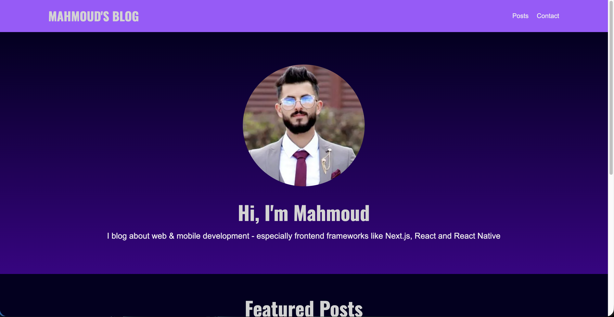
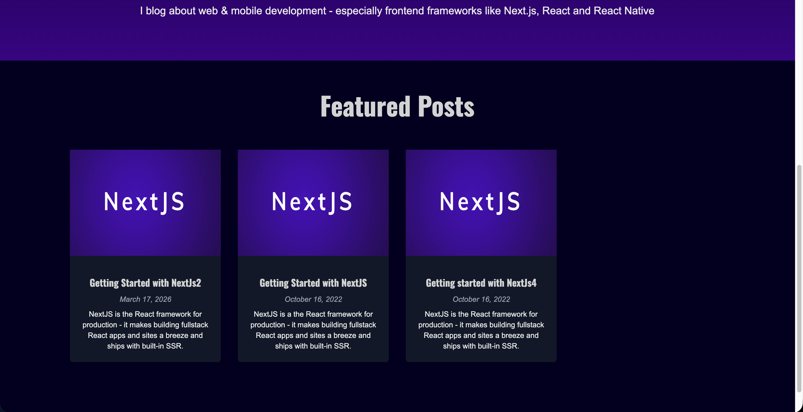
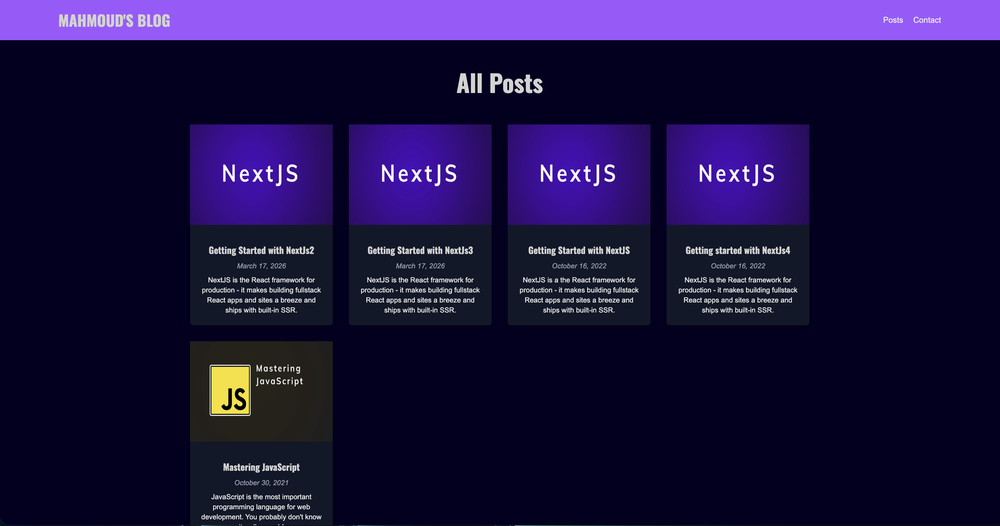
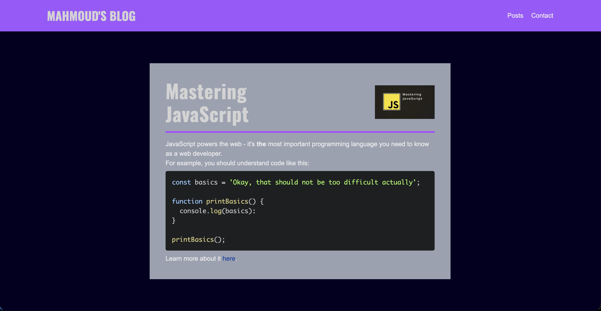
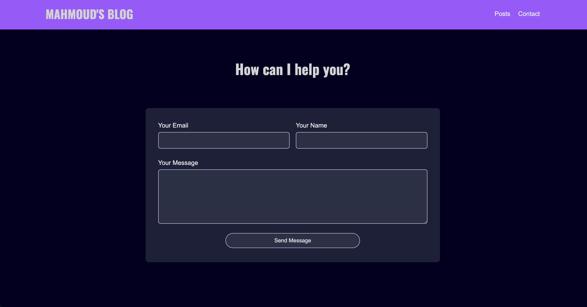

# ✍️ My Front-End Blog

A personal blog website built with Next.js and MongoDB where I share content about front-end development, including React, Next.js, and React Native.

The website also includes a contact page where visitors can send messages, which are stored in a MongoDB database.

---

## 🚀 Features

- 📰 Blog posts about front-end development  
- ⚛️ Topics: React, Next.js, React Native  
- 📩 Contact form to send messages  
- 💾 Messages stored in MongoDB  
- ⚡ Fast and responsive UI  

---

## 📸 Screenshots

<table>
  <tr>
    <th>### 🏠 Home / Blog Page</th>
    <th>### 📖 Featured Posts</th>
    <th>### 📖 All Posts Page</th>
    <th>### 📖 Blog Post Page</th>
    <th>### 📩 Contact Page</th>
  </tr>
  <tr>
    <td>
      
    </td>
    <td>
      
    </td>
    <td>
      
    </td>
    <td>
      
    </td>
    <td>
      
    </td>
  </tr>
</table>

---

## 🛠️ Getting Started

Install dependencies:

```bash
npm install

```

Run the development server:

```bash
npm run dev

```
Open [http://localhost:3000](http://localhost:3000) in your browser.

---

## 📁 Project Structure

- pages/index.tsx → Blog homepage
- pages/posts/index.tsx → Blog posts page
- pages/posts/[slug].tsx → Blog single post page
- pages/contact.tsx → Contact form page
- pages/api/ → API routes (contact handling) & MongoDB connection.

## 🔌 API

- POST /api/contact → Save a new message.

---

## 🌐 Environment Variables

Create a .env file:

```env
MONGO_DB_URL=your_mongodb_connection_string
MONGO_DB_NAME=your_moongodb_database_name

```

---

## 🚀 Deployment

This project is deployed using Vercel.

Steps:

- Push to GitHub
- Import project into Vercel
- Add environment variables
- Deploy

---

## 📚 Tech Stack

- Next.js
- React
- MongoDB


---

✨ About

This project is a personal space where I:

- Share what worthes to be shared in front-end development
- Encourage Juniors/Mid level developers in building front-end & full-stack features
- Experiment with modern web technologies

💙 Author

Mahmoud Saleh

Senior Front-End Developer